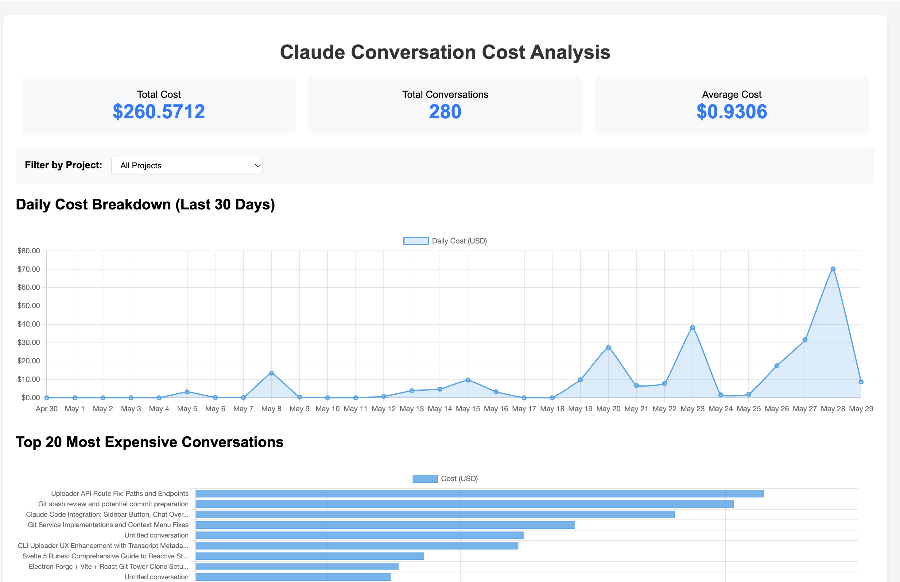

# Claude Code Costs Analyzer - Enhanced Edition



A comprehensive tool to analyze your Claude Code conversation costs with advanced visualizations, real-time monitoring, and detailed analytics.

💡 **Want to see how I use Claude Code?** [Here's my workflow](https://spiess.dev/blog/how-i-use-claude-code) and approach to getting things done with it.

## ✨ New Features in v2.0

- 📊 **Real-time Token Burn Visualization** - Monitor token consumption live
- 🛠️ **Tool Usage Analytics** - Track which tools cost the most
- 🎯 **MCP Integration Tracking** - Analyze Model Context Protocol usage
- 📈 **Advanced Visualizations** - 10+ interactive charts and graphs
- ⚡ **Session Intelligence** - Deep session analysis with idle time detection
- 🔔 **Smart Alerts** - Configurable cost and usage alerts
- 📁 **Multi-format Export** - CSV, JSON export support
- 🎨 **Dark Mode** - Toggle between light and dark themes
- ⚙️ **Configuration System** - Customize alerts, display, and more

## 🚀 Quick Start

No installation required! Just run:

```bash
npx claude-code-costs
```

## 📋 What It Does

This enhanced tool analyzes all your Claude Code conversations and provides:

### Core Analytics
- Total costs across all conversations with model breakdown
- Daily/hourly cost patterns and trends
- Project-based cost comparison
- Token usage and burn rate analysis
- Tool usage frequency and cost analysis
- Error rate tracking and analysis
- Session duration and productivity insights

### Visualizations
- **Daily Cost Trend** - Interactive line chart with zoom
- **Activity Heatmap** - Hourly usage patterns
- **Tool Usage Distribution** - Doughnut chart of tool usage
- **Model Cost Breakdown** - Cost by model type
- **Token Burn Rate** - Real-time and historical analysis
- **Project Comparison** - Side-by-side project analytics
- **Session Timeline** - Interactive session explorer
- **Command Usage Matrix** - Track slash command usage

### Real-time Monitoring
```bash
npx claude-code-costs --monitor
```
- Live token consumption tracking
- Active session cost updates
- Real-time alerts for high usage
- Token burn rate monitoring

## 🎮 Command Line Options

```bash
npx claude-code-costs [options]

Options:
  -m, --monitor          Enable real-time monitoring mode
  -e, --export <format>  Export data (formats: html, csv, json)
  -p, --project <name>   Filter by project name
  -d, --days <number>    Number of days to analyze (default: 30)
  -h, --help            Show help message
```

### Examples

```bash
# Generate interactive HTML report (default)
npx claude-code-costs

# Start real-time monitoring
npx claude-code-costs --monitor

# Export last 7 days to CSV
npx claude-code-costs --days 7 --export csv

# Analyze specific project
npx claude-code-costs --project myapp

# Export all data as JSON
npx claude-code-costs --export json
```

## ⚙️ Configuration

Settings are stored in `~/.claude-code-costs/config.json`. You can customize:

### Alert Settings
- Daily cost threshold
- Session cost threshold  
- Token burn rate threshold
- Enable/disable alerts

### Display Settings
- Theme (light/dark)
- Currency display
- Date/time format
- Chart animations

### Monitoring Settings
- Auto-refresh interval
- Show notifications
- Default filters

Example configuration:
```json
{
  "alerts": {
    "enabled": true,
    "dailyCostThreshold": 10.0,
    "sessionCostThreshold": 2.0,
    "tokenBurnRateThreshold": 10000
  },
  "display": {
    "theme": "dark",
    "currency": "USD",
    "chartAnimations": true
  }
}
```

## 📊 Dashboard Features

The enhanced HTML dashboard includes:

### Overview Tab
- Summary cards with key metrics
- Daily cost trend chart
- Activity heatmap
- Top expensive conversations

### Tool Usage Tab  
- Tool usage distribution
- Cost by tool analysis
- Command usage statistics
- Error tracking by tool

### Models Tab
- Model usage distribution
- Cost breakdown by model
- Token usage by model type

### Sessions Tab
- Interactive session timeline
- Token burn rate analysis
- Session duration insights
- Idle time detection

### Projects Tab
- Project cost comparison
- Project tool usage matrix
- Cross-project analytics

### Settings Tab
- Configure alerts
- Change display preferences
- Export options
- Theme switcher

## 🔧 Requirements

- Node.js 14.0.0 or higher
- Claude Code conversations stored in `~/.claude/projects/`

## 📁 Output Formats

### HTML Report (Default)
- Interactive dashboard with all visualizations
- Real-time filtering and search
- Responsive design for all devices
- Print-friendly layout

### CSV Export
- All conversation data
- Includes tool usage summary
- Compatible with Excel/Google Sheets

### JSON Export
- Complete data export
- Includes all analytics
- Machine-readable format
- Preserves full detail

## 🏗️ Architecture

The tool is built with a modular architecture:

```
claude-code-costs/
├── lib/
│   ├── parser.js      # Enhanced JSONL parser
│   ├── analyzer.js    # Data analysis engine
│   ├── visualizer.js  # Report generation
│   ├── monitor.js     # Real-time monitoring
│   └── config.js      # Configuration management
├── config/
│   └── defaults.json  # Default settings
└── index.js          # Main entry point
```

## 🤝 Contributing

Contributions are welcome! Please feel free to submit a Pull Request.

## 📄 License

MIT

## 🙏 Acknowledgments

Built with love for the Claude Code community. Special thanks to all users who provided feedback and feature requests.

---

**Note**: This tool only analyzes conversations stored locally on your machine. No data is sent to external servers.